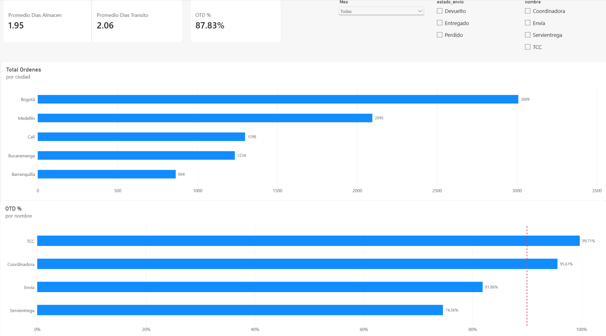
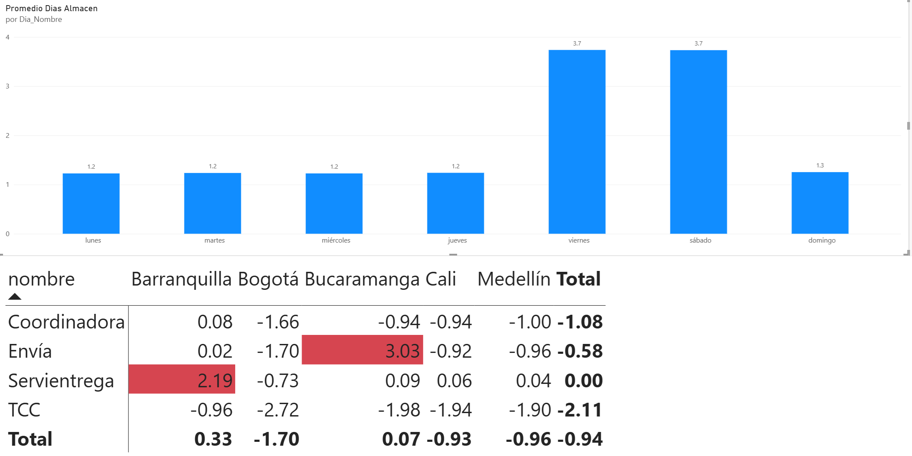

# 📦 Optimización de Última Milla y Análisis SLA (Simulación E-commerce)

## 🎯 Contexto del Negocio
Una empresa de e-commerce enfrenta un estancamiento en su indicador global de entregas a tiempo (OTD). Este proyecto simula, diagnostica y propone soluciones a los cuellos de botella operativos a través de un análisis integral del ciclo de vida del envío, desde la preparación en el almacén hasta la entrega en la última milla.

## 🛠️ Arquitectura y Tecnologías
* **Generación de Datos y EDA:** Python (Pandas, NumPy, Datetime) en Google Colab.
* **Almacenamiento y Diagnóstico:** SQLite3 para la exploración de datos relacionales mediante consultas SQL.
* **Visualización:** Power BI para el desarrollo de un panel gerencial interactivo.

## 📊 Panel Ejecutivo y Hallazgos
Para facilitar la toma de decisiones, se diseñó un dashboard interactivo estructurado en dos niveles de profundidad:

### 1. Visión Ejecutiva (Macro)
Muestra el volumen de operaciones y el rendimiento general de los transportistas, evidenciando que el OTD global se encuentra estancado en un 87.83%, por debajo de la meta exigida del 90%.

### 2. Diagnóstico de Cuellos de Botella (Micro)
Tras analizar el *Cycle Time* aislando los tiempos internos y externos, se detectaron las fallas de raíz expuestas en el panel de control:

* **Falla Interna (Bodega):** Durante los días viernes y sábado, el tiempo promedio de empaque se dispara a **3.8 días** (frente a 1.3 días en el resto de la semana), evidenciando un colapso en la capacidad operativa de fin de semana.
* **Falla Externa (Última Milla):** Dos rutas específicas penalizan drásticamente el indicador global:
  * **Envía:** Desviación crítica de **+3.0 días** sobre su SLA en envíos hacia Bucaramanga.
  * **Servientrega:** Retraso constante de **+2.2 días** sobre su SLA en envíos hacia Barranquilla.

## 💡 Recomendaciones Estratégicas
* **Refuerzo Operativo:** Contratar personal de empaque *part-time* exclusivamente para los turnos de viernes y sábado, absorbiendo el pico de demanda y estabilizando los tiempos internos.
* **Enrutamiento Dinámico:** Restringir temporalmente la asignación de paquetes hacia Bucaramanga y Barranquilla a los proveedores Envía y Servientrega, derivando ese volumen a TCC y Coordinadora hasta establecer planes de mejora continua verificables.

---
**Autor:** William Suárez | Analista de Datos
